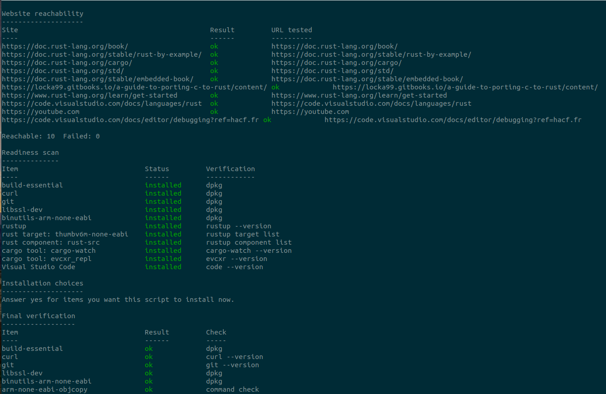
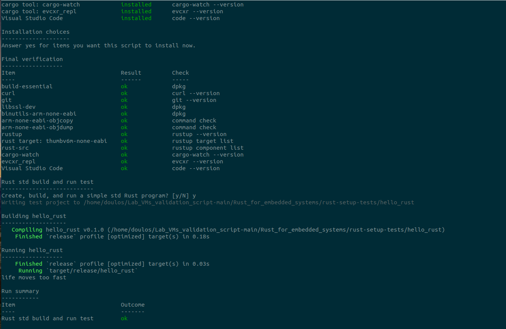

# Installation validation script

This is a multi-purpose script designed to facilitate the validation of a development environment. 

The script is specifically designed to test an environment in the context of the Rust fundamentals' class. The script does the following operations:

1. Tests for the reachability of the various websites used during the class and reports any anomalies. 
2. Tests for the required software to run the Rust fundamentals' class. 

> Note: the step 2 will report missing software when executed inside the Doulos VM since some of the exercises consist in installing the missing software. In other word the step 2 is only needed in a scenario where the customer wants to use his/her own virtual machine (Ubuntu 26.04) to run the exercises instead of ours.

3. Offer to install missing packages.
4. Verify installation of the missing packages
5. Offer to compile a embedded Rust project
6. Run and execute a simple terminal example 
7. Offer to revert previously done installations

This script passes shellcheck cleanly. See <https://www.tecmint.com/shellcheck-shell-script-code-analyzer-for-linux/> for more information on shellcheck.

To run the bash script, execute the `./validate_rust_fundamentals_setup.sh`

> Note: You may need to make the script executable with a
> `chmod +x validate_rust_fundamentals_setup.sh`

